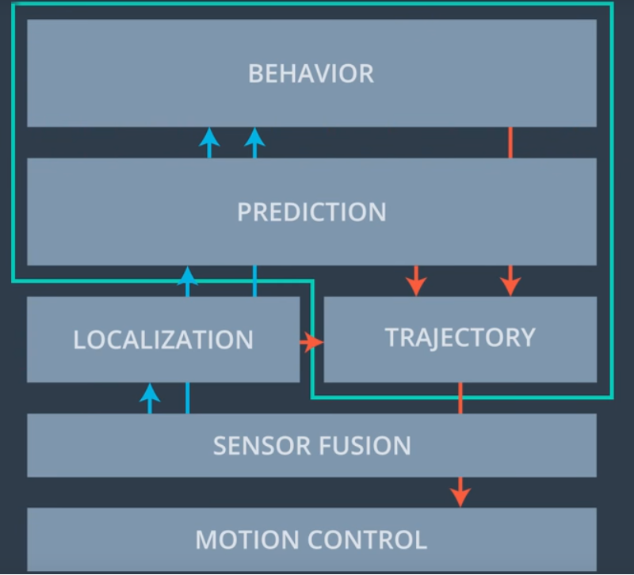

# Project: Path Planning
## Overview
This project is about using a path planner to generate safe/optimal trajectory for navigating a car through a track that is shared by other cars that accelerate/decelerate  & change lanes.

## How Does It Work?

The path planner works on the basis of generating a set of waypoints that results in a smooth path, both for staying in the same lane and changing lanes. 

In a broader sense, the path planning involves the input of other modules as well as depicted in the below image:



Particularly, the path planning problem is concerned with the modules highlighted in the above image.  

**Note:** This particular implementation of the project is a simplified version of the path planner. A full blown implementation (in progress) can be viewed [here](https://github.com/wkhattak/Path-Planning-v2-Work-In-Progress).

The current implementation of the path planner can be summarised as below:

1. Find if ego car (autonomous car) is close to any non-ego car.
2. Take action e.g. slow down to keep following or change lane if possible.
3. Generate trajectory either for changing lane or staying in the same lane.

## Pertinent Information

The car transmits its location, along with its sensor fusion data, which estimates the location of all the vehicles on the same side of the road.

### Waypoints
The path planner should output a list of x and y global map coordinates. Each pair of x and y coordinates is a point, and all of the points together form a trajectory. Every 20 ms the car moves to the next point on the list. The car's new rotation becomes the line between the previous waypoint and the car's new location.

### Velocity
The velocity of the car depends on the spacing of the points. Because the car moves to a new waypoint every 20ms, the larger the spacing between points, the faster the car will travel. The speed goal is to have the car traveling at (but not above) the 50 MPH speed limit as often as possible. But there will be times when traffic gets in the way.

### Using Previous Path Points
Using information from the previous path ensures that there is a smooth transition from cycle to cycle. But the more waypoints we use from the previous path, the less the new path will reflect dynamic changes in the environment.

Ideally, we might only use a few waypoints from the previous path and then generate the rest of the new path based on new data from the car's sensor fusion information.

### Timing
The simulator runs a cycle every 20 ms (50 frames per second), but the C++ path planner will provide a new path at least one 20 ms cycle behind. The simulator will simply keep progressing down its last given path while it waits for a new generated path.

This means that using previous path data becomes even more important when higher latency is involved. Imagine, for instance, that there is a 500ms delay in sending a new path to the simulator. As long as the new path incorporates a sufficient length of the previous path, the transition will still be smooth.

A concern, though, is how accurately we can predict other traffic 1-2 seconds into the future. An advantage of newly generated paths is that they take into account the most up-to-date state of other traffic.

### Highway Map
Inside `data/highway_map.csv` there is a list of waypoints that go all the way around the track. The track contains a total of 181 waypoints, with the last waypoint mapping back around to the first. The waypoints are in the middle of the double-yellow diving line in the centre of the highway.

The track is 6945.554 meters around (about 4.32 miles). If the car averages near 50 MPH, then it should take a little more than 5 minutes for it to go all the way around the highway.

The highway has 6 lanes total - 3 heading in each direction. Each lane is 4 m wide and the car should only ever be in one of the 3 lanes on the right-hand side. The car should always be inside a lane unless doing a lane change.

### Waypoint Data
Each waypoint has an (x,y) global map position, and a Frenet s value and Frenet d unit normal vector (split up into the x component, and the y component).

The s value is the distance along the direction of the road. The first waypoint has an s value of 0 because it is the starting point.

The d vector has a magnitude of 1 and points perpendicular to the road in the direction of the right-hand side of the road. The d vector can be used to calculate lane positions. For example, if you want to be in the left lane at some waypoint just add the waypoint's (x,y) coordinates with the d vector multiplied by 2. Since the lane is 4 m wide, the middle of the left lane (the lane closest to the double-yellow diving line) is 2 m from the waypoint.

If you would like to be in the middle lane, add the waypoint's coordinates to the d vector multiplied by 6 = (2+4), since the centre of the middle lane is 4 m from the centre of the left lane, which is itself 2 m from the double-yellow diving line and the waypoints.

### Sensor Fusion
It's important that the car doesn't crash into any of the other vehicles on the road, all of which are moving at different speeds around the speed limit and can change lanes.

The sensor_fusion variable contains all the information about the cars on the right-hand side of the road.

The data format for each car is: `[id, x, y, vx, vy, s, d]`. The id is a unique identifier for that car. The x, y values are in global map coordinates, and the vx, vy values are the velocity components, also in reference to the global map. Finally s and d are the Frenet coordinates for that car.

The vx, vy values can be useful for predicting where the cars will be in the future. For instance, if you were to assume that the tracked car kept moving along the road, then its future predicted Frenet s value will be its current s value plus its (transformed) total velocity (m/s) multiplied by the time elapsed into the future (s).

### Changing Lanes
Any time the ego vehicle approaches a car in front of it that is moving slower than the speed limit, the ego vehicle should consider changing lanes.

The car should only change lanes if such a change would be safe, and also if the lane change would help it move through the flow of traffic better.

For safety, a lane change path should optimise the distance away from other traffic. For comfort, a lane change path should also result in low acceleration and jerk.

### Data
Here is the data provided from the Simulator to the C++ Program

**Main car's localisation data (No Noise):**

[x] The car's x position in map coordinates

[y] The car's y position in map coordinates

[s] The car's s position in frenet coordinates

[d] The car's d position in frenet coordinates

[yaw] The car's yaw angle in the map

[speed] The car's speed in MPH

**Previous path data given to the planner:**

[previous_path_x] The previous list of x points previously given to the simulator

[previous_path_y] The previous list of y points previously given to the simulator

**Previous path's end s and d values:** 

[end_path_s] The previous list's last point's frenet s value

[end_path_d] The previous list's last point's frenet d value

**Sensor Fusion Data, a list of all other car's attributes on the same side of the road. (No Noise):**

[sensor_fusion] A 2d vector of cars and then that car's [car's unique ID, car's x position in map coordinates, car's y position in map coordinates, car's x velocity in m/s, car's y velocity in m/s, car's s position in frenet coordinates, car's d position in frenet coordinates. 

## Rubric Points

### Goals
In this project your goal is to safely navigate around a virtual highway with other traffic that is driving +-10 MPH of the 50 MPH speed limit. You will be provided the car's localization and sensor fusion data, there is also a sparse map list of waypoints around the highway. The car should try to go as close as possible to the 50 MPH speed limit, which means passing slower traffic when possible, note that other cars will try to change lanes too. The car should avoid hitting other cars at all cost as well as driving inside of the marked road lanes at all times, unless going from one lane to another. The car should be able to make one complete loop around the 6946m highway. Since the car is trying to go 50 MPH, it should take a little over 5 minutes to complete 1 loop. Also the car should not experience total acceleration over 10 m/s^2 and jerk that is greater than 10 m/s^3.

#### The map of the highway is in data/highway_map.txt
Each waypoint in the list contains  [x,y,s,dx,dy] values. x and y are the waypoint's map coordinate position, the s value is the distance along the road to get to that waypoint in meters, the dx and dy values define the unit normal vector pointing outward of the highway loop.

The highway's waypoints loop around so the frenet s value, distance along the road, goes from 0 to 6945.554.

## Basic Build Instructions

1. Clone this repo.
2. Make a build directory: `mkdir build && cd build`
3. Compile: `cmake .. && make`
4. Run it: `./path_planning`.


## Dependencies

* cmake >= 3.5
  * All OSes: [click here for installation instructions](https://cmake.org/install/)
* make >= 4.1
  * Linux: make is installed by default on most Linux distros
  * Mac: [install Xcode command line tools to get make](https://developer.apple.com/xcode/features/)
  * Windows: [Click here for installation instructions](http://gnuwin32.sourceforge.net/packages/make.htm)
* gcc/g++ >= 5.4
  * Linux: gcc / g++ is installed by default on most Linux distros
  * Mac: same deal as make - [install Xcode command line tools]((https://developer.apple.com/xcode/features/)
  * Windows: recommend using [MinGW](http://www.mingw.org/)
* [uWebSockets](https://github.com/uWebSockets/uWebSockets)
  * Run either `install-mac.sh` or `install-ubuntu.sh`.
  * If you install from source, checkout to commit `e94b6e1`, i.e.
    ```
    git clone https://github.com/uWebSockets/uWebSockets 
    cd uWebSockets
    git checkout e94b6e1
    ```

## Usage

Follow the build instructions above. Once the program is running, start the simulator. You should see a *connected!!!* message upon successful connection between the simulator and the c++ program. Hit the *Start button*. 

## Directory Structure

* **data:** Directory containing a list of waypoints that go all the way around the track
* **images:** Directory containing writeup images
* **src:** Directory containing c++ source files
* **CMakeLists.txt:** File containing compilation instructions
* **README.md:** Project readme file
* **install-mac.sh:** Script for installing uWebSockets on Macintosh
* **install-ubuntu.sh:** Script for installing uWebSockets on Ubuntu

## License

The content of this project is licensed under the [Creative Commons Attribution 3.0 license](https://creativecommons.org/licenses/by/3.0/us/deed.en_US).